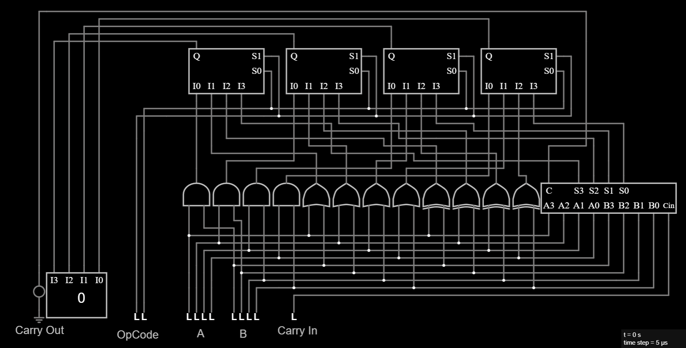

# 4-Bit ALU (Arithmetic Logic Unit)

## Overview
This project implements a 4-bit ALU (Arithmetic Logic Unit) using Falstad Circuit Simulator. The ALU performs four operations on 4-bit inputs `A` and `B`, selected by a 2-bit `OpCode`.

The operations are computed in parallel, and a 4-to-1 multiplexer selects the final output based on `OpCode`.

Additionally, a `Carry Out` output is provided for the ADD operation.

---

## Operations Supported

| OpCode | Operation | Description |
|--------|-----------|-------------|
| 00     | AND       | Bitwise A AND B |
| 01     | OR        | Bitwise A OR B |
| 10     | XOR       | Bitwise A XOR B |
| 11     | ADD       | A + B (using Ripple Carry Adder) |

---

## Inputs

| Name      | Description |
|-----------|-------------|
| A[3:0]    | 4-bit input operand A |
| B[3:0]    | 4-bit input operand B |
| OpCode[1:0] | Selects operation |
| Carry In  | Carry input for the ADD operation (usually 0) |

---

## Outputs

| Name      | Description |
|-----------|-------------|
| Result[3:0] | Output of selected operation |
| Carry Out  | Carry-out bit from addition (overflow indicator) |

---

## Schematic
Falstad Circuit Schematic of the 4-Bit ALU:

> Note: The ALU performs all operations in parallel and uses 4-to-1 multiplexers to select the final output for each bit.

---

## Files

| File Name               | Description                        |
|------------------------|------------------------------------|
| `4_Bit_ALU.txt`        | Falstad circuit file (text format, no extension on local save) |
| `4_Bit_ALU_Schematic.png` | Image of circuit schematic        |

---

## Test Cases

Example test inputs for verification:

| A     | B     | OpCode | Operation | Expected Output | Carry Out |
|-------|-------|--------|-----------|-----------------|-----------|
| 5 (0101) | 3 (0011) | 00 | AND | 1 (0001) | 0 |
| 5       | 3       | 01 | OR  | 7 (0111) | 0 |
| 5       | 3       | 10 | XOR | 6 (0110) | 0 |
| 5       | 3       | 11 | ADD | 8 (1000) | 0 |
| 15 (1111) | 15 (1111) | 11 | ADD | 14 (1110) | 1 |

---

## Notes
This project demonstrates modular and scalable hardware design principles used in ASIC and FPGA development. It serves as a fundamental building block for future CPU or datapath designs.

---

## Tools Used
- Falstad Circuit Simulator
