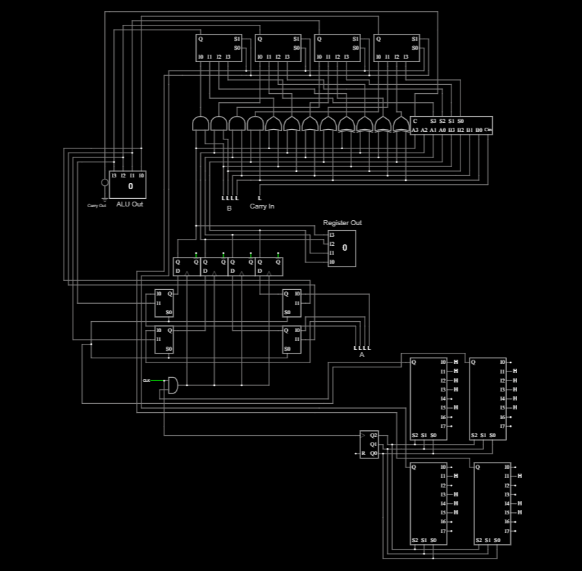

# Program Counter CPU — 4-Bit Datapath with Automated Instruction Execution

## Overview
This project implements a 4-bit datapath with a Program Counter (PC) and hardcoded Instruction Memory using a MUX-based ROM.

The system automatically executes instructions stored in ROM, demonstrating core CPU design principles:
- Datapath and Control Separation
- Program Counter driven execution
- ALU Operations
- Register Load Enable control
- Synchronous Design with a single clock domain

---

## Tools Used
- Falstad Circuit Simulator

---

## Architecture

### Main Components:
- 3-Bit Program Counter (PC) — Increments every clock cycle.
- MUX-ROM Instruction Memory — Hardcoded instruction set based on PC output.
- 4-Bit Register — Stores current value, loads based on control logic.
- 4-Bit ALU — Performs AND, OR, XOR, and ADD operations with Carry Out.

---

## Instruction Format

| Bits | Meaning |
|------|---------|
| [3:2] | ALU OpCode (`00`=AND, `01`=OR, `10`=XOR, `11`=ADD) |
| [1]   | Register Input Select (`0`=Data In, `1`=ALU Out) |
| [0]   | Load Enable (`1`=Load Register, `0`=Hold Register Value) |

---

## Instruction Memory Contents (3-Bit PC)

| PC Value | Instruction | Meaning | Notes |
|----------|-------------|---------|-------|
| `000`    | `0001`      | Load `Data In` into Register | Set `Data In = 5` |
| `001`    | `1111`      | ADD `Data In` to Register | Set `Data In = 3` |
| `010`    | `0011`      | AND `Data In` with Register | Set `Data In = 7` |
| `011`    | `0111`      | OR `Data In` with Register | Set `Data In = 15` |
| `100`    | `1110`      | ADD `Data In` to Register, Hold Register | Load Enable = 0 |
| `101`    | `1111`      | ADD `Data In` to Register | Set `Data In = 1` |
| `110`    | `0000`      | NOP | Register holds value |
| `111`    | `0000`      | NOP | Register holds value |

---

## Execution Flow

| Step | Operation | Register Value After |
|------|-----------|----------------------|
| 1    | Load 5    | 5 |
| 2    | ADD 3     | 8 |
| 3    | AND 7     | 0 |
| 4    | OR 15     | 15 |
| 5    | ADD (Hold)| 15 (Unchanged) |
| 6    | ADD 1     | 0 (Overflow) |
| 7-8  | NOP       | Hold Current Value |

---

## Schematic

Falstad Circuit Schematic:

---

## Notes

- This project demonstrates a fully automated CPU execution model.
- The Program Counter increments on every clock cycle, driving a hardcoded instruction memory.
- The datapath executes operations based on these instructions without manual intervention.
- This design models the architecture and execution behavior of simple processors.

---
