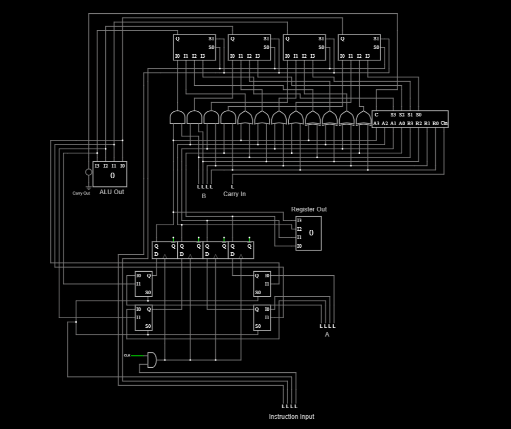

# 4-Bit Datapath with Custom Instruction Control

## Overview
This project implements a 4-bit CPU-like datapath using Falstad Circuit Simulator, controlled by a custom 4-bit instruction format.

The system features:
- A 4-bit Register with Load Enable and synchronous clocking.
- A 4-bit ALU supporting AND, OR, XOR, and ADD operations.
- Instruction-based control for register loading, ALU operations, and input selection.
- Manual instruction loading using switches.

---

## Instruction Format

Each instruction is 4 bits:

| Bits | Meaning |
|------|---------|
| [3:2] | ALU OpCode (`00`=AND, `01`=OR, `10`=XOR, `11`=ADD) |
| [1]   | Register Input Select (`0`=Data In, `1`=ALU Output) |
| [0]   | Load Enable (`1`=Load Register, `0`=Hold Register Value) |

---

## Example Instructions

| Instruction | Meaning |
|-------------|---------|
| `0001` | Load Data In into Register |
| `1111` | ADD Register + Data In, Load Result |
| `0011` | AND Register & Data In, Load Result |
| `0111` | OR Register & Data In, Load Result |
| `1110` | ADD Register + Data In, *Hold Register Value* (Load Enable = 0) |

---

## Inputs

| Name                 | Description |
|---------------------|-------------|
| Data In[3:0]        | External data input |
| Instruction[3:0]    | Determines operation and control signals |
| Clock               | Controls Register loading on rising edge |
| Reset               | Resets Register to `0000` |

---

## Outputs

| Name            | Description |
|-----------------|-------------|
| Register Out[3:0] | Stored value in Register |
| ALU Out[3:0]      | Output of ALU operation |
| Carry Out         | Carry out bit from addition |

---

## Schematic
Falstad Circuit Schematic of the 4-Bit Datapath with Instruction Control:

---

## Test Cases

| Step | Operation | Data In | Instruction | Register Value After |
|------|-----------|---------|-------------|----------------------|
| 1    | Load 5 | 5 (`0101`) | `0001` | 5 |
| 2    | ADD 3 | 3 (`0011`) | `1111` | 8 |
| 3    | AND 7 | 7 (`0111`) | `0011` | 0 |
| 4    | OR 15 | 15 (`1111`) | `0111` | 15 |
| 5    | ADD 15 (No Load) | 15 (`1111`) | `1110` | 15 (Unchanged) |
| 6    | ADD 1 | 1 (`0001`) | `1111` | 0 (Carry Out = 1) |

---

## File Structure

| File Name                        | Description |
|---------------------------------|-------------|
| `Simple_Instruction_CPU.txt`    | Falstad circuit file (text format) |
| `Simple_Instruction_CPU_Schematic.png` | Image of circuit schematic |

---

## Notes
This project demonstrates key CPU design principles:
- Datapath and Control separation.
- Instruction-based operation execution.
- Synchronous data storage and ALU-driven computation.

This design structure models a simple processor core and prepares for more advanced CPU and HDL projects.

---

## Tools Used
- Falstad Circuit Simulator
