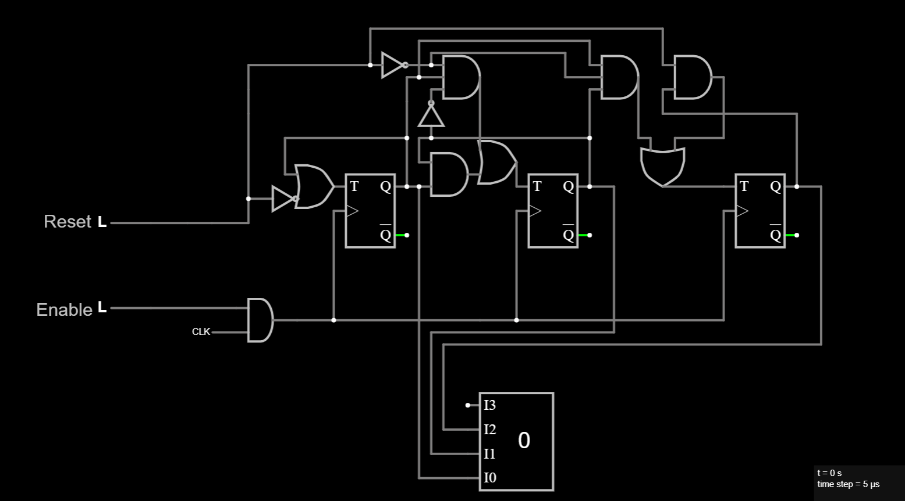

# 3-Bit Synchronous Counter

## Overview
This project implements a 3-bit synchronous binary counter using T Flip-Flops. The counter includes active-high `Reset` and active-high `Enable` inputs.

On each rising edge of the clock signal, if `Enable` is high (`1`), the counter increments by 1. If `Reset` is high (`1`), the counter resets to 0 immediately.

The counter outputs are displayed using a 3-bit output connected to a display.

---

## Features
- 3-bit synchronous counting (000 → 111)
- Active-high asynchronous reset
- Active-high enable signal
- Modular T Flip-Flop based design
- Clean schematic and signal routing
- Simulated in Falstad Circuit Simulator

---

## Inputs
| Name     | Description                              |
|----------|------------------------------------------|
| CLK      | Clock signal                            |
| Reset    | Active-high reset (counter resets to 0 when high)  |
| Enable   | Active-high enable (counter counts when high)|

---

## Outputs
| Name | Description               |
|------|---------------------------|
| Q0   | Least Significant Bit (LSB) |
| Q1   | Middle bit                 |
| Q2   | Most Significant Bit (MSB) |

---

## Schematic
Falstad Circuit Schematic of the 3-bit Counter:

> Note: T Flip-Flops are used with AND gates for clock gating and enable logic. Output is displayed on a 3-bit display for easy visualization.

---

## Files
| File Name                   | Description                    |
|----------------------------|--------------------------------|
| `3_Bit_Counter.falstad`    | Falstad circuit file (text format) |
| `3_Bit_Counter_Schematic.png` | Image of circuit schematic |

---

## Notes
This counter is a fundamental sequential logic circuit and forms the basis for more complex digital systems such as datapaths, CPUs, and FSM-controlled modules.

---

## Tools Used
- Falstad Circuit Simulator
