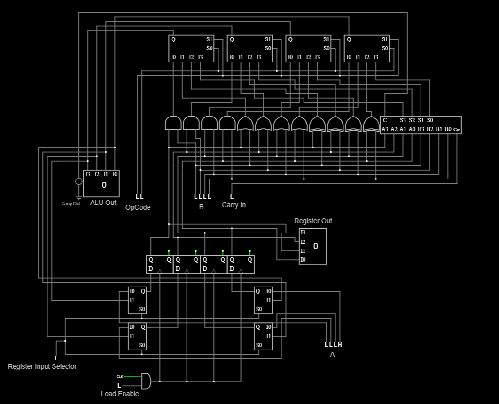

# 4-Bit Datapath with ALU and Register

## Overview
This project implements a simple 4-bit datapath using Falstad Circuit Simulator. The datapath demonstrates core CPU design principles, including:

- Data storage with a 4-bit Register (D Flip-Flops)
- Arithmetic and logic operations using a 4-bit ALU
- Input selection between external data and ALU result
- Controlled state updates using Load Enable and Clock

This design models how real processors store and manipulate data.

---

## Features
- 4-bit Register with Load Enable and synchronous Clocking
- 4-bit ALU with four operations:
  - AND
  - OR
  - XOR
  - ADD (Ripple Carry Adder with Carry Out)
- Multiplexer to select Register input (ALU Result vs Data In)
- Carry Out from ALU for addition overflow detection
- Clean signal routing and modular structure

---

## Operation Encoding (ALU OpCode)

| OpCode | Operation |
|--------|-----------|
| 00     | AND       |
| 01     | OR        |
| 10     | XOR       |
| 11     | ADD       |

---

## Inputs

| Name                 | Description |
|---------------------|-------------|
| Data In[3:0]        | External data input |
| OpCode[1:0]         | ALU operation select |
| Register Input Selector | Selects between Data In and ALU Output for Register input |
| Load Enable         | Enables loading new data into Register on Clock edge |
| Clock               | Controls when Register captures new data |
| Reset (Optional)    | Resets Register to 0 |

---

## Outputs

| Name            | Description |
|-----------------|-------------|
| Register Out[3:0] | Stored value in Register |
| ALU Out[3:0]      | Output of ALU operation |
| Carry Out         | Carry out bit from addition |

---

## Schematic
Falstad Circuit Schematic of the 4-Bit Datapath:

---

## Test Cases

| Step | Operation | Inputs | Expected Register Value |
|------|-----------|--------|-------------------------|
| 1    | Load Data In | Data In = 5 (0101) | 5 |
| 2    | ADD 3 | Data In = 3, OpCode = 11 (ADD) | 8 |
| 3    | AND 7 | Data In = 7, OpCode = 00 (AND) | 0 |
| 4    | XOR 15 | Data In = 15, OpCode = 10 (XOR) | 15 |

---

## Carry Out Verification

| Register Value | Data In | Operation | Result | Carry Out |
|----------------|---------|-----------|--------|-----------|
| 15 (1111)      | 15 (1111) | ADD | 14 (1110) | 1 |

---

## File Structure

| File Name                      | Description |
|--------------------------------|-------------|
| `4_Bit_Datapath.txt`           | Falstad circuit file (text format) |
| `4_Bit_Datapath_Schematic.png` | Image of circuit schematic |

---

## Notes
This project demonstrates how data flows between storage (Register) and computation units (ALU) in a basic processor architecture. This structure forms the foundation for larger CPU designs and HDL-based implementations.

---

## Tools Used
- Falstad Circuit Simulator
