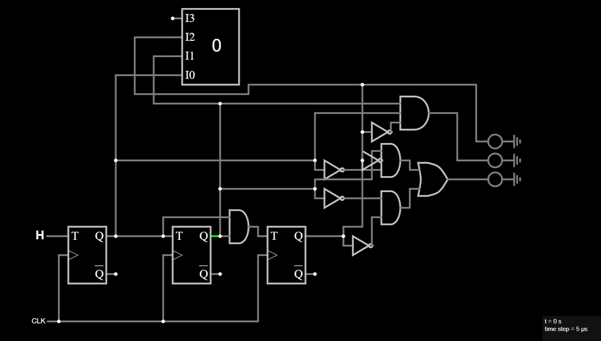

# Traffic Light Controller (Finite State Machine)

## Overview
This project implements a traffic light controller using a Finite State Machine (FSM) built with T Flip-Flops and combinational output logic.

The FSM cycles through 3 states representing traffic light conditions:
1. Red Light
2. Green Light
3. Yellow Light

The controller transitions through these states on each clock pulse, simulating a basic traffic light system.

---

## Features
- FSM-based state transition logic
- 3-state sequence: Red → Green → Yellow → Red
- Synchronous operation using T Flip-Flops
- Output logic decoded from state values
- Clean schematic and organized design
- Simulated in Falstad Circuit Simulator

---

## Inputs
| Name     | Description                      |
|----------|----------------------------------|
| CLK      | Clock signal (advances state)   |

---

## Outputs
| Name   | Description                     |
|--------|---------------------------------|
| Red    | Turns on during Red state       |
| Yellow | Turns on during Yellow state    |
| Green  | Turns on during Green state     |

---

## Schematic
Falstad Circuit Schematic of the Traffic Light Controller FSM:

> Note: The FSM uses T Flip-Flops to store state and combinational logic gates (AND, OR, NOT) to decode the outputs.

---

## Files
| File Name                         | Description                            |
|----------------------------------|----------------------------------------|
| `Traffic_Light_Controller.falstad` | Falstad circuit file (text format)    |
| `Traffic_Light_Controller_Schematic.png` | Image of circuit schematic         |

---

## Notes
This project demonstrates fundamental FSM design principles used in hardware systems. Traffic light controllers are classic examples of state machines in digital design.

---

## Tools Used
- Falstad Circuit Simulator
